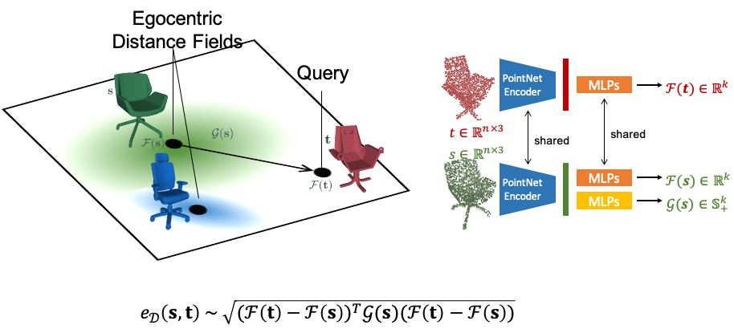

# Deformation-Aware 3D Shape Embedding and Retrieval
[Mikaela Angelina Uy](https://mikacuy.github.io), [Jingwei Huang](http://cs.stanford.edu/~jingweih/), [Minhyuk Sung](https://mhsung.github.io), [Tolga Birdal](http://tbirdal.me/), [Leonidas Guibas](https://geometry.stanford.edu/member/guibas/)

ECCV 2020

